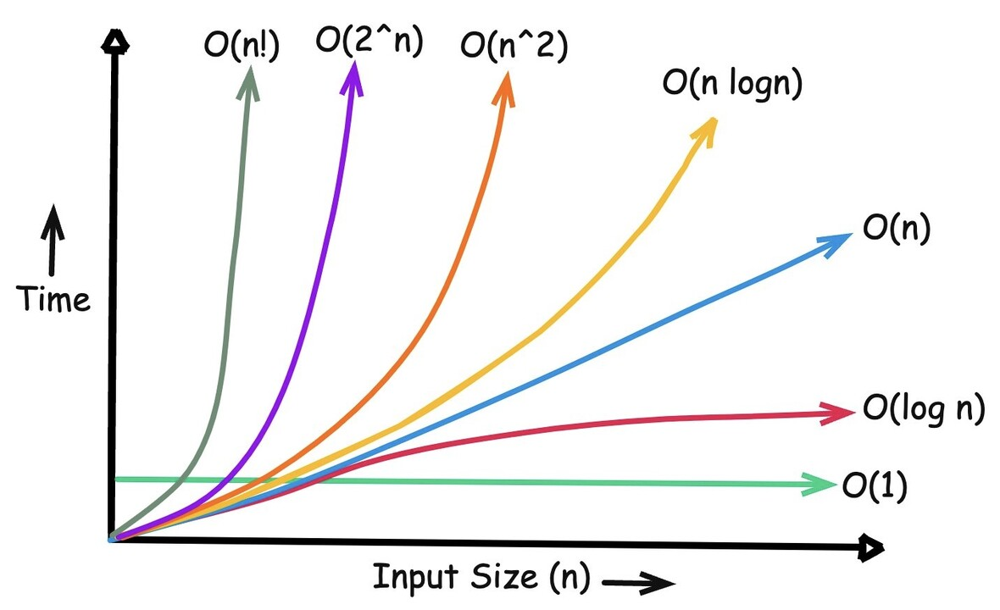

# Day 4: O Grande

## What Big O actually measures

How the runtime (or memory) scales as the input gets bigger?

Big O describes the **cost of an algorithm** as the input grows. An O(n) algorithm on a slow laptop can beat an O(n²) algorithm on a supercomputer once `n` is large enough, because the O(n²) one is doing fundamentally more work per extra element.


### Time complexity vs space complexity

- **Time complexity**: the number of *operations* grows with `n`.
- **Space complexity**: the memory needed by the algorithm beyond the input itself, as `n` grows.


## The complexity classes



- **O(1) — constant.** Same cost regardless of `n`. For example Array index access (`arr[i]`), a HashMap `get`.

- **O(log n) — logarithmic.** The problem shrinks by a constant
  *fraction* each step. Binary search: each comparison halves the
  remaining search space.

  ```
  N = 16
  N -> 8 -> 4 -> 2 -> 1        (4 halvings to go from 16 to 1)
  ```

  16 = 2⁴, so it took 4 steps — in general, `n` elements take
  `log₂ n` steps. Doubling the input only adds **one more step**, which
  is what makes O(log n) so cheap at scale.

- **O(n) — linear.** Cost grows in direct proportion to `n`. A single
  pass over an array or list.

- **O(n log n) — linearithmic.** A linear pass repeated `log n` times,
  or `log n` work done `n` times. For example comparison-based sorts (merge sort, heap sort).

- **O(n²) — quadratic.** Typically a nested loop where the inner loop
  also runs proportional to `n` — comparing every element against every
  other element.

- **O(2ⁿ) — exponential.** Cost doubles with every additional element.
  Common in naive recursive solutions that branch into two (or more)
  sub-calls per step, worked through below with Fibonacci.

- **O(n!) — factorial.** Cost multiplies by `n` with every additional
  element. Brute-forcing every permutation of `n` items.

## Calculating complexity: practical rules

### Sequential blocks add

Two separate loops over two different inputs, one after the other:

```java
for (int i = 0; i < n; i++) { /* ... */ }   // O(N)
for (int j = 0; j < m; j++) { /* ... */ }   // O(M)
```

Total cost is O(N) + O(M) = **O(N + M)**. They add, because they run one after the other, not one inside the other.

### Nested blocks multiply

```java
for (int i = 0; i < n; i++) {
    for (int j = 0; j < m; j++) { /* ... */ }
}
```

The inner loop runs `m` times for *every* iteration of the outer loop:
**O(N × M)**. When both loops run over the same input, this becomes the
familiar O(N²).

### Drop constants

```
O(2N)     => O(N)
O(N + N)  => O(2N) => O(N)
```

Doing the work twice still grows linearly, so the constant factor is dropped.

### Drop lower-order terms

```
O(N² + N)  => O(N²)
```

As `n` grows large, the `N²` term dominates so completely that the `N`
term becomes irrelevant to the overall shape. 

## Amortized time

One operation is occasionally expensive but rare enough that it doesn't affect the average.

**Example: `ArrayList` (a dynamically resizing array).** It gives the
benefits of a plain array (O(1) indexed access) plus the ability to
grow. Most `add()` calls are O(1) — there's spare capacity, so the new
element just gets placed at the end. But when capacity runs out, an
`add()` triggers:

1. Allocate a new backing array (commonly double the size).
2. Copy every existing element into it -> O(N).
3. Then place the new element.

That single resize is O(N), but it only happens occasionally, and each
time it happens the *next* resize is twice as far away. Spread the
occasional O(N) cost across all the O(1) inserts that happened since the
last resize, and the **average cost per insert is still O(1)** — that's
amortized O(1), not "sometimes O(1), sometimes O(N)" treated as a
worst-case O(N) for every call.

## Recursive time complexity

For a recursive function, draw the **call tree** and count the calls.

```java
int fibonacci(int n) {
    if (n <= 2) return 1;
    return fibonacci(n - 1) + fibonacci(n - 2);
}
```

Every call that isn't a base case makes two more calls. Call tree for
`fibonacci(5)`:

```
f(5)
├── f(4)
│   ├── f(3)
│   │   ├── f(2)  [base case]
│   │   └── f(1)  [base case]
│   └── f(2)  [base case]
└── f(3)
    ├── f(2)  [base case]
    └── f(1)  [base case]
```

### Time complexity

Each level of the tree can have up to twice as many calls as the level
before it:

```
level 0: 1 call
level 1: 2 calls
level 2: 4 calls
...
level n: 2^n calls
```

Add up the levels and the total is roughly **O(2ⁿ)** — the work doubles
with every extra step of `n`.

### Space complexity

Space is about the **call stack**: how many calls are waiting at once.
`fibonacci` only goes one branch deep at a time, so at most `n` calls
stack up. That's **O(n)** space — much less than the O(2ⁿ) total calls.
